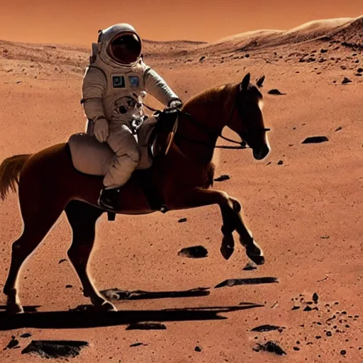

# Stable Diffusion Image Generation #

The short script uses the hosted huggingface model `"CompVis/stable-diffusion-v1-4"` to generate images.  
This is a stable diffusion model that is run based on user defined `prompts`.


### Usage ###

- Obtain a huggingface token and store it in `~/.huggingface/token`.
- Build the environment from the included conda [`environment.yml`](./environment.yml). (I dont want to hear it young man, conda is fine for this.)
- Run [`favicon_generator.py`](./favicon_generator.py) script using the command
    ```sh
    python favicon_generator.py
    ```
- Optional modifications can be made to `prompts`, `guidance_scales`, and `device` hardware:
    ```py
    # Set image generating prompts.
    prompts = ["favicon of an octopus", "goose god"]

    # Guidance scales determine how much the model should follow the prompt.  
    # Lower values are less reflective of the prompt.
    guidance_scales = np.arange(1,11,1)

    # Choose hardware model is running on: GPU or CPU training.
    device = choose_hardware("cpu")
    ```

**Note:**<br>
Images were changed from original `*.png` format to `*.webp` format using the [`manipulate_images_for_web.py`](./manipulate_images_for_web.py) script originally written for my [computational_photography](https://github.com/cmutnik/computational_photography/blob/master/util/manipulate_images_for_web.py) repo.  This script isnt optimized, so the best way to use it follow these commands: Copy script into dir containing images to convert, change into that dir, run the script on all images, and remove old png files:
```sh
scp manipulate_images_for_web.py ./figs/.
cd ./figs/
python manipulate_images_for_web.py
rm *.png
```

### Examples ###

The following images are samples made with this technique.  

 

> Prompt used: "favicon of an octopus"

 

> Prompt used: "a painting of water lillies, in the style of monet"

 

> Prompt used: "astronaut rides horse with spacy and ftfy installed resized"

 

> Prompt used: "a cartoon monkey riding a skateboard resized"
